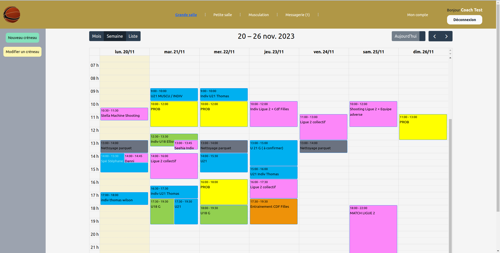
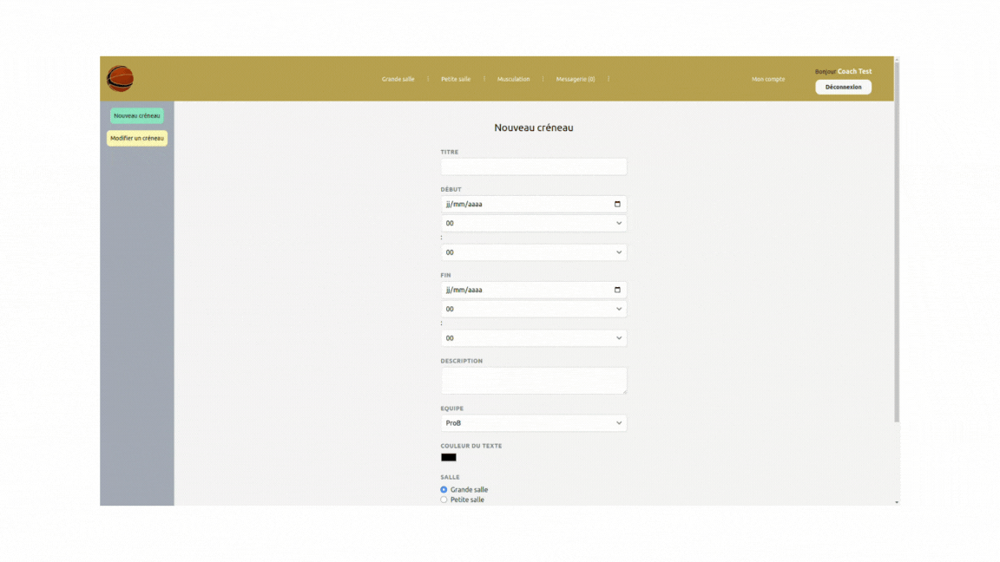
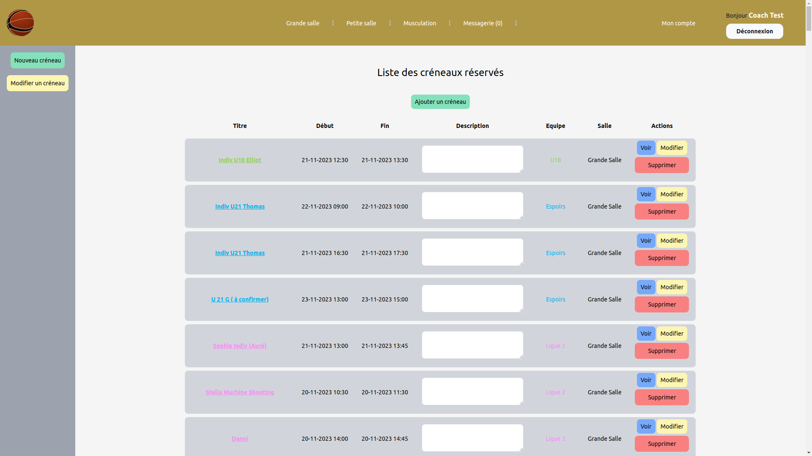
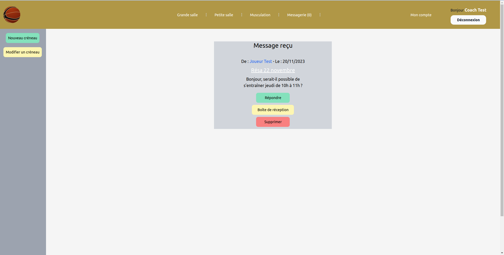
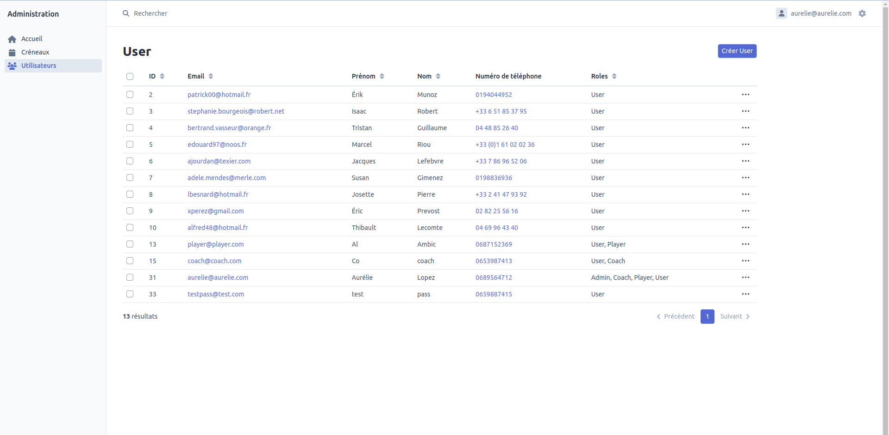

# champagnebasket-creneaux

## Présentation

Cette application est un **calendrier partagé**.
Elle répond à un **besoin client**, un club de basket professionnel avec plusieurs équipes, 2 salles d'entraînements et une salle de musculation.
Les **coachs** peuvent visualiser, réserver ou modifier les différents créneaux de chaque salle.
Les **joueurs** peuvent visualiser et demander un créneau à leur coach pour un entrainement individuel via une **messagerie interne**.
Enfin un **utilisateur** lambda à juste la possibilité de visualiser les différents créneaux horaires.
Le ou les **administrateurs** ont également accès à un **backoffice** leur permettant d'avoir une vision d'ensemble et de gérer les utilisateurs avec leurs rôles.

L'application est fonctionnelle et déployée : [champagnebasket-creneaux](https://www.champagnebasket-creneaux.fr).

Il faut être validé par un administrateur pour accèder à la plupart des fonctionnalités, voici donc quelques captures d'écran pour un aperçu d'ensemble :

